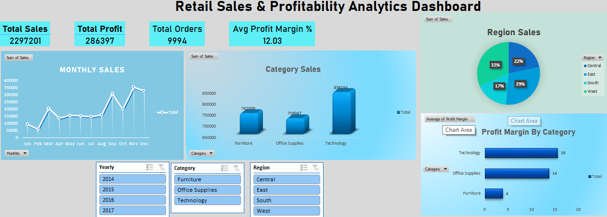

# Retail Sales & Profitability Analytics Dashboard

An interactive Excel dashboard created using a retail sales dataset to analyze business performance, sales trends, regional contribution, and profitability.

---

## Project Overview

This dashboard was built to understand how different product categories and regions contribute to overall sales and profit. The project focuses on turning raw retail data into meaningful business insights using Excel.

---

## Features

- KPI metrics for:
  - Total Sales
  - Total Profit
  - Total Orders
  - Avg Profit Margin %

- Monthly sales trend analysis
- Category-wise sales comparison
- Regional sales analysis
- Interactive slicers for filtering data
- Profit margin analysis by category

---

## Tools Used

- Microsoft Excel
- Pivot Tables
- Pivot Charts
- Slicers
- Data Cleaning

---

## Key Insights

- Technology category generated the highest sales
- Office Supplies showed stronger profitability
- Sales peaked during the end of the year

---

## Dashboard Preview

---

## Files Included

- `Retail_Sales_Profitability_Dashboard.xlsx`
- `dashboard-preview.png`
- `Sales Data.csv`

---

## Learning Outcome

This project helped me improve my skills in:
- Data cleaning
- Dashboard creation
- Business analysis
- Data visualization
- Excel reporting
